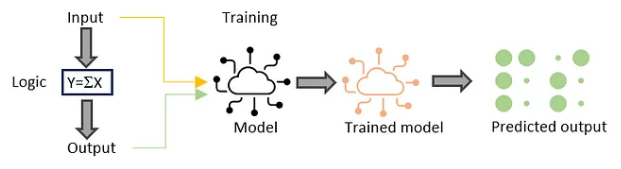
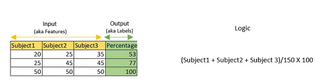
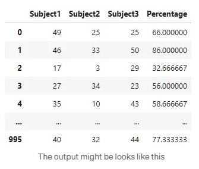

## Machine Learning Model-Simple example

We’ll explore a straight forward model . No complex algorithms, just the fundamentals.

There are multiple kinds of ML models such as supervised learning models, unsupervised learning models, reinforcement learning models, etc. All the machine learning models are trained with a large number of data sets and their corresponding desired outputs.




To better understand it, let’s consider a very simple use case: calculating the percentage of marks for three subjects ( Marks are out of 50).



With this pattern, let’s try to understand how a machine learning model gets trained and how it predicts values. Prediction is nothing but giving a new data set to the model for calculation, and the model will generate results based on how it was trained.

First, let’s create a dataset similar to the table above to provide input to the model.

```from random import randint
data_set_count = 1000 # ML model requires large number of examples to learn.Hence creating 1000 rows of marks.
random_number_max_range = 50

training_input = list()
training_output = list()
for i in range(data_set_count):
    subject1 = randint(0, random_number_max_range)
    subject2 = randint(0, random_number_max_range)
    subject3 = randint(0, random_number_max_range)
    percentage = ((subject1+subject2+subject3)/150)*100
    training_input.append([subject1, subject2, subject3])
    training_output.append(percentage)
```


To view the data set use below code snippet

```import pandas as pd
df = pd.DataFrame(training_input, columns=["Subject1","Subject2","Subject3"])                
df['Percentage']=training_output
display(df)
```




In this example, a linear regression model has been selected, which falls under the category of supervised learning models that predict numerical output.

**Ensure sklearn library has been installed, if not use below command**

`pip install sklearn`


Run the below code 

```from sklearn.linear_model import LinearRegression
#scikit-learn, often abbreviated as sklearn, is a popular Python library for machine learning. 
model = LinearRegression(n_jobs=-1)
model.fit(X=training_input, y=training_output)
```

The model stored in the ‘model’ variable is now trained and can recognize how inputs relate to outputs. We didn’t give it specific logic or equations; it learned from the examples in the training data. Let’s use this model to make predictions with new input data.

``` input_data = [[20, 30, 40]]
percentage_predicted = model.predict(X=input_data)                                     
print("Calculated percentage is" + str(percentage_predicted))
```

`Calculated percentage is[60.]
`

Hope you could follow the steps. To get more understanding , I encourage you to experiment and try something new with this dataset. Finding the average is another example you can explore to gain a different perspective on the data.

Take this as a very small starting point on your journey into the world of machine learning and AI. Dive deep into the exciting realm of cutting-edge ML and AI trends. All the best !
