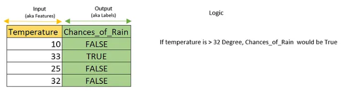

## Machine Learning Model-Simple example


Logistic Regression is a statistical model used for binary classification, which means it’s used to predict one of two possible outcomes based on one or more predictor variables. Example like a yes or no answers

I hope you have basic idea about how a model works else please go to my older post on Linear regression model.

In this example we are going to see how a Logistic regression model works with an example.

Let’s consider a hypothetical example for the sake of understanding the logic: predicting the likelihood of rain occurring this week based solely on temperature data. Please note that this example is purely for educational purposes and is not intended to represent a realistic use case.


Lets create data set which matches the above table.

```from random import randint
data_set_count = 1000 # ML model requires large number of examples to learn.Hence creating 1000 rows of marks.
random_number_max_range = 40
training_input = list()
training_output = list()
for i in range(data_set_count):
    #Generating temperature value randomly
    Temperature = randint(0, random_number_max_range)
    # Assuming a logic for the example; if tempreature goes above 32 the chances for rain is True else Flase
    is_Temp_greate_than_level=lambda temperature, level: temperature > level
    is_Rain=is_Temp_greate_than_level(Temperature,32)
    training_input.append([Temperature])
    training_output.append(is_Rain)
```
To view the data set

```import pandas as pd
df = pd.DataFrame(training_input, columns=["Temperature"])                
df['Chance_for_Rain']=training_output
display(df)
```


Train the model with above data set. Here we are choosing the Logistic Regression model from sklearn library.

```
from sklearn.linear_model import LogisticRegression
#scikit-learn, often abbreviated as sklearn, is a popular Python library for machine learning. 
model = LogisticRegression(n_jobs=-1)
model.fit(X=training_input, y=training_output)
```

We didn’t give it specific logic or equations as input rather just values in the data set; it learned from the examples in the training data. Let’s use this model to make predictions with new input data.

```input_data = [[33]]
percentage_predicted = model.predict(X=input_data)                                     
print("Will we get rain? " + str(percentage_predicted))

Will we get rain? [ True]
```

Here the out come of the prediction will be either True or False based on the input data.

I would highly encourage you to try similar kind of problem to understand this model. Predicting whether a student will pass (1) or fail (0) an exam based on the number of hours they studied would be another example that you can try.

All the best!.