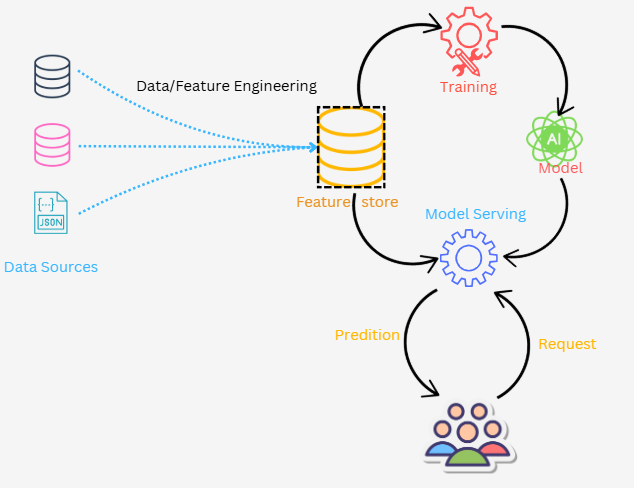

### A machine learning model is like a smart robot that learns from example
Remember when we were a child, learning to tell which is a mango and which is a ball?
 It wasn't instant. You saw countless examples, felt their textures, and gradually your brain built a mental model. Machine learning works in a surprisingly similar way.

Think about it: we learned through experience. We saw different shapes, colors, and sizes of mangoes and balls. Over time, we recognized the patterns that made a mango a mango, and a ball a ball.

Now, imagine teaching a computer to do the same. That's essentially what machine learning is. We provide the computer with a massive dataset – pictures of mangoes and balls, for example. We organize this data, perhaps in a table, with each image labeled "mango" or "ball."

The machine learning program then analyzes this data, searching for those same patterns we learned as children. It looks at the shapes, colors, textures, and other properties of the objects. It stores this information, essentially building its own "mental model" of what a mango and a ball look like. These sepcial kind of programme we usually call Models.

Once the program has learned from this data, it can start making predictions. When presented with a new image, it can analyze the object's properties and compare them to what it has learned. If the new object matches the learned properties of a mango, the program identifies it as such. If it matches the properties of a ball, it's identified as a ball.

This is the core idea behind machine learning. By feeding computers large amounts of data, we enable them to learn patterns and make predictions, just like we do. It's about teaching computers to see the world, and understand it, through the power of data.

Think of it like this: our parents were, in a way, our first "data engineers." They curated and classified the data (mangoes and balls) to make it understandable for us. Similarly, in machine learning, the process of selecting, cleaning, classifying, and preparing the data is called data engineering.

The machine learning program then analyzes this carefully engineered data, searching for those same patterns we learned as children. It looks at the shapes, colors, textures, and other properties of the objects. It stores this information, essentially building its own "mental model" of what a mango and a ball look like.

**Features**

Think of all the stuff you see in the world – that's a ton of data. But if you want to know if something is a ball or a mango, you don't need all of it. You only need the important stuff, like its shape, size, or how it feels.

These important pieces of information – the things that help you guess what something is – are called features in machine learning. They're like the clues a computer uses to figure things out.

And when the ML programme uses those clues to make a guess? That guess is called a prediction. So, features are the clues, and the prediction is the computer's answer after it looks at those clues.

**Feature Engineering**

Feature engineering is like being a detective and finding the best clues to solve a mystery.
Feature engineering is the art of creating new, more useful clues (features) from your data to help your machine learning model make better predictions.

 It's about taking raw data and turning it into something truly insightful.   

**End to End Flow**

For now just understand that feature store is a storage location where the selected features are getting stored [ will expalin the actual details later in this document]

Sources and related content

* **[ML Terms](Terms_reffers_in_ML.md)**
  
We’ll explore a straight forward model . No complex algorithms, just basic steps to start on ML.
* **[Linear Regression](Linear_regression.md)**

* **[Logistic Regression](Logistic_regression.md)**

