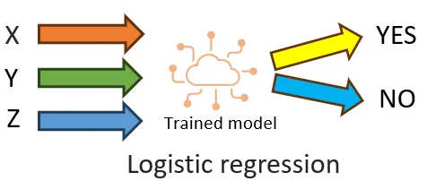
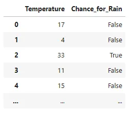

## Machine Learning Model-Simple example

Logistic Regression is a statistical model used for binary classification, which means it’s used to predict one of two possible outcomes based on one or more predictor variables. Example like a yes or no answers

I hope you have basic idea about how a model works else please go to my older post on Linear regression model.

In this example we are going to see how a Logistic regression model works with an example.

Let’s consider a hypothetical example for the sake of understanding the logic: predicting the likelihood of rain occurring this week based solely on temperature data. Please note that this example is purely for educational purposes and is not intended to represent a realistic use case.

Lets create data set which matches the above table.

`from random import randint
`data_set_count = 1000 # ML model requires large number of examples to learn.Hence creating 1000 rows of marks.
`random_number_max_range = 40

`training_input = list()
`training_output = list()
`for i in range(data_set_count):
`    #Generating temperature value randomly
`    Temperature = randint(0, random_number_max_range)
`    # Assuming a logic for the example; if tempreature goes above 32 the chances for rain is True else Flase
`    is_Temp_greate_than_level=lambda temperature, level: temperature > level
`    is_Rain=is_Temp_greate_than_level(Temperature,32)
`    training_input.append([Temperature])
`    training_output.append(is_Rain)